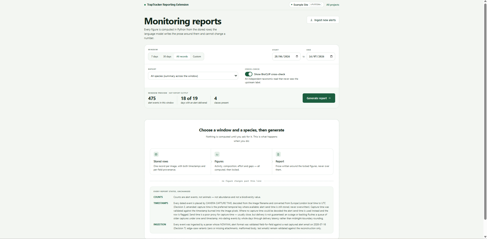
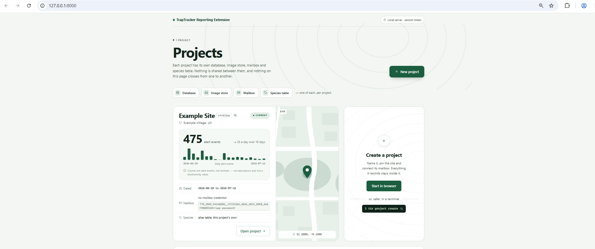
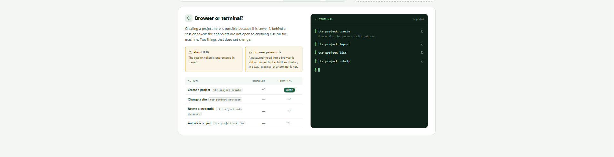
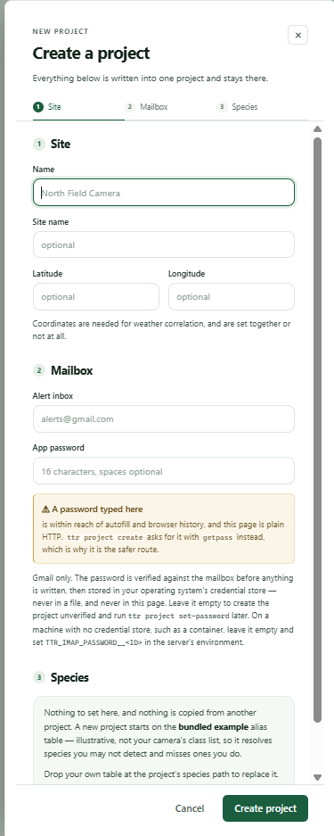
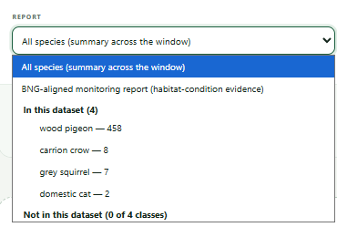
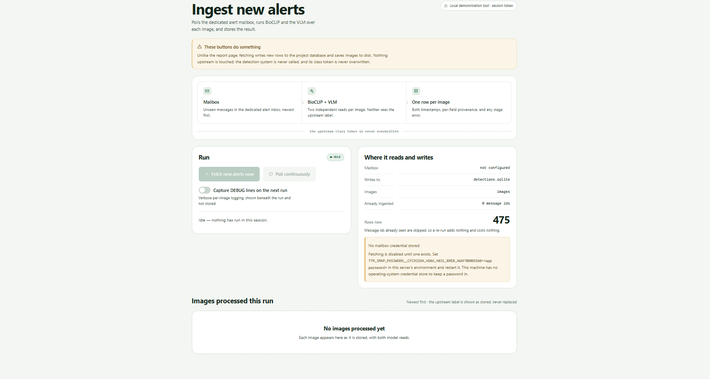
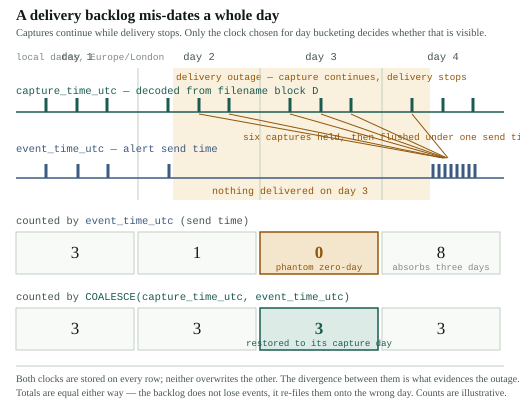

# TrapTracker Automatic Reporting Extension (`ttr`)

**Automatic, evidence-first reports from Trap Tracker's wildlife detection alerts,
built to give conservationists back the hours spent compiling them.**

`ttr` is an MSc research project that extends [Trap Tracker](https://traptracker.co.uk/),
the AI wildlife-detection system developed by the Conservation AI Research Group at
Liverpool John Moores University. Trap Tracker spots animals in camera-trap images and
emails an alert for each detection. `ttr` picks up those alerts, checks and enriches
them, stores them, and turns them into day-by-day monitoring reports in Markdown, HTML
and PDF. Every figure in a report is computed directly from the stored records; a
local language model only writes the summary around those figures.



---

## Contents

- [Why automatic reporting](#why-automatic-reporting)
- [Trap Tracker, and where this project picks up](#trap-tracker-and-where-this-project-picks-up)
- [How reports are generated](#how-reports-are-generated)
- [The web interface](#the-web-interface)
- [Run it with Docker](#run-it-with-docker)
- [Run it with Python](#run-it-with-python)
- [Results](#results)
- [Repository structure](#repository-structure)
- [Known issues and limitations](#known-issues-and-limitations)
- [References](#references) · [About Trap Tracker](#about-trap-tracker) · [Licence](#licence) · [Acknowledgements](#acknowledgements)

---

## Why automatic reporting

Camera traps have made wildlife monitoring far cheaper to collect, but not to use. A
single camera can produce hundreds of detections in a few weeks. Someone still has to
sort them, tally them by species and by day, notice when the camera went quiet, check
the doubtful identifications and write it all up. That work is repetitive and slow,
and it takes time away from the fieldwork, analysis and decisions that need a
conservationist's expertise.

Automatic reporting is meant to take that compiling work off their hands:

- **It frees up hours.** Counting, charting, gap-finding and drafting are done in
  seconds, for any species and any date range, as often as needed.
- **It speeds up decisions.** A report can be produced the day the alerts arrive, so
  a change at a site (a new species, a drop in activity, a camera outage) is visible
  while there is still time to act on it, not at the end of a season.
- **It is consistent.** Every report is built the same way from the same records, so
  reports from different weeks or sites can be compared.

**It is built to assist conservationists, not to replace them.** `ttr` does not
decide what a finding means or what to do about it. It prepares the evidence and is
explicit about how far that evidence goes: every report states that its counts are
alert events rather than individual animals, how each event was dated, and where the
automated species check disagreed with the detector. The judgement stays with the
people who know the site.

---

## Trap Tracker, and where this project picks up

### How Trap Tracker works

[Trap Tracker](https://traptracker.co.uk/) is developed by the **Conservation AI
Research Group** at Liverpool John Moores University, led by **Dr Paul Fergus**, who
also supervised this project. Its real-time edition works like this:

1. **Cameras email their photos.** Trail cameras at a site send each image they
   capture to an inbox that Trap Tracker watches.
2. **An AI model looks for animals.** Trap Tracker runs each image through an
   object-detection model, which finds and labels the animals (and people or
   vehicles) in it, each with a confidence score.
3. **Detections become alerts.** Each project has a watch list of species. When one
   of them is detected above its confidence threshold, Trap Tracker emails an alert
   to the people monitoring the site. The alert names the species and its confidence,
   gives the time, and attaches the original photo and a copy with the detection
   boxed.

### Where `ttr` picks up

Trap Tracker's job ends when the alert is sent. What arrives is a stream of separate
emails, useful one at a time but hard to see a pattern in: a few weeks from one camera
can mean hundreds of them. `ttr` starts from that inbox.

```
 Trap Tracker                                  ttr (this project)
 ────────────────────────────────────          ─────────────────────────────────────────
 camera ─▶ detection model ─▶ alert email ─▶   read ─▶ check ─▶ enrich ─▶ store ─▶ report
```

It reads only the alert emails. It does not run, import or modify any Trap Tracker
code, and it never needs access to Trap Tracker's database or images.

---

## How reports are generated

```
alert inbox (Gmail)
   │
   ▼  1. Read ──────── sources/      fetch only new alert emails
   ▼  2. Parse ─────── sources/      species, confidence, time, both photos
   ▼  3. Date ──────── sources/      recover the capture time from the photo's filename
   ▼  4. Check ─────── crop/,        crop to the animal, then a second, independent
   │                   enrichment/   species identification with BioCLIP
   ▼  5. Enrich ────── enrichment/   historical weather · a description of the photo
   ▼  6. Store ─────── storage/      one database per project, one row per alert
   ▼  7. Report ────── agents/       figures in Python, then a written summary
   ▼  8. Present ───── web/, cli.py  web UI · Markdown · HTML · PDF
```

1. **Read.** `ttr` polls the project's alert inbox and downloads only messages it has
   not already stored. A message is only marked as handled once it has been saved, so
   a failure part-way through never loses an alert.
2. **Parse.** Each email becomes a structured record. Anything the email does not
   contain is recorded as missing rather than guessed.
3. **Date.** The email carries the time it was *sent*, which can lag the photo by
   hours or days when the camera's connection drops. `ttr` decodes the real capture
   time from the photo's filename and keeps the send time alongside it.
4. **Check.** An independent detector (RT-DETR) crops the photo to the animal, and
   BioCLIP, a biology-specific vision model, identifies the species without seeing
   Trap Tracker's label. The two answers are compared, and disagreements are kept and
   measured by how far apart they are taxonomically.
5. **Enrich.** Each record gains the weather at the site at capture time (from
   Open-Meteo) and a short description of the photo from a local vision model.
6. **Store.** Everything goes into a SQLite database belonging to that project, with
   the source of every field recorded.
7. **Report.** For the chosen species and date range, Python computes every count,
   daily trend, comparison, gap and chart. A local language model (via Ollama) is then
   given those fixed figures and asked for a plain-English summary. A check rejects
   any summary that describes alert events as numbers of animals; if the model fails
   or keeps breaking that rule, the summary is left out and the report says why. The
   figures never depend on the model.
8. **Present.** Reports come in three kinds: **all species**, **one species**, and a
   format aligned with **Biodiversity Net Gain (BNG)** habitat-condition evidence
   (supporting evidence, not a statutory plan). They can be read in the web UI or
   saved as Markdown, HTML or PDF.

---

## The web interface

`ttr serve` (or the Docker setup below) starts a local web UI. The screenshots show
the worked example project, built from the published data.

**Projects.** Each monitoring site is a project with its own database, photos,
mailbox and species list. Its card shows the number of alert events, a daily chart,
the dates covered and the site on a map.



The page also shows which project tasks can be done in the browser and which are
safer in a terminal, where a typed password cannot be caught by browser autofill or
history.



**Creating a project.** Name the site, optionally pin its coordinates (needed for
weather), and connect its Gmail alert inbox. The password is tested against the
mailbox before anything is saved, then kept in the operating system's credential
store.



**Choosing a report.** Pick all species, the BNG-aligned format, or a single species;
each species is listed with its number of alert events.



**Ingesting alerts.** Fetch new alerts once or keep polling. The page shows where the
run reads and writes, and stays disabled until the project has a mailbox password.



---

## Run it with Docker

Docker is the quickest way to run the web UI. The image includes Chromium for PDF
export and the published example data. You need
[Docker Desktop](https://www.docker.com/products/docker-desktop/) (or Docker Engine
with the Compose plugin) and Git. Run every command from the repository root.

The Compose file is [`docker/compose.yaml`](docker/compose.yaml), so every `docker
compose` command below passes `-f docker/compose.yaml`. It is kept out of the
repository root on purpose: from there, Compose would read the app's own `.env`.

### 1. Build and start

```bash
git clone https://github.com/Michael-R254/TrapTracker-Automatic-Reporting-Extension.git
cd TrapTracker-Automatic-Reporting-Extension

docker compose -f docker/compose.yaml up -d --build
```

`--build` builds the image before starting it; later starts can leave it out. This
builds the web UI only. For the species cross-check and cropping models (PyTorch,
several GB), build with the extras instead:

```bash
TTR_EXTRAS=web,enrich,detect docker compose -f docker/compose.yaml up -d --build
# Windows PowerShell:  $env:TTR_EXTRAS = "web,enrich,detect"; docker compose -f docker/compose.yaml up -d --build
```

### 2. Open the web UI

The UI is protected by a session token. The server prints the address to open, token
included, when it starts:

```bash
docker compose -f docker/compose.yaml logs -f ttr
```

```text
ttr-1  | TrapTracker Automatic Reporting Extension is running.
ttr-1  |
ttr-1  | Open in your browser:
ttr-1  | http://localhost:8000/?token=3q2-7wQ...
```

Open that link. Press Ctrl-C to stop following the log; the container keeps running.
Inside the container the server listens on `0.0.0.0`, which Docker needs in order to
forward the port, but the port is published on your machine's loopback only, so the
UI is reachable at `localhost` from your own machine and from nowhere else.

A new token is created every time the container starts. To keep one bookmarkable URL,
set your own token (at least 32 letters, digits, `-` or `_`) before starting:

```bash
export TTR_UI_TOKEN="$(python -c "import secrets; print(secrets.token_urlsafe(32))")"
# Windows PowerShell:  $env:TTR_UI_TOKEN = python -c "import secrets; print(secrets.token_urlsafe(32))"
docker compose -f docker/compose.yaml up -d
```

The log then shows `http://localhost:8000/?token=<TTR_UI_TOKEN>` rather than the token
itself; open it with your value in place. Set the same value in each new terminal
before running `up` again.

To use a port other than 8000, set `TTR_PORT` before starting. The printed address
follows it:

```bash
TTR_PORT=8080 docker compose -f docker/compose.yaml up -d
# Windows PowerShell:  $env:TTR_PORT = "8080"; docker compose -f docker/compose.yaml up -d
```

### 3. Explore the example project

The first time the container starts, it builds an **Example Site** project from the
published data (475 alerts from one garden camera), so the UI has something to show
without a mailbox. Open **Example Site** and choose the **All records** window to
cover the whole dataset.

The example is only built into an empty projects volume, and only once: delete it and
it stays deleted. To skip it, set `TTR_NO_EXAMPLE=1` in the container's environment.
To build it again later:

```bash
docker compose -f docker/compose.yaml run --rm ttr project load-example
```

### 4. Written summaries (optional)

Reports render in full without a language model, with the summary replaced by a note.
For summaries, run [Ollama](https://ollama.com/) on your machine and pull the model
(`ollama pull llava`); the container looks for it on port 11434 of your machine. If it
cannot reach it, or you would rather run Ollama in Docker too:

```bash
docker compose -f docker/compose.yaml --profile ollama up -d
docker compose -f docker/compose.yaml exec ollama ollama pull llava
OLLAMA_ENDPOINT=http://ollama:11434 docker compose -f docker/compose.yaml up -d
# Windows PowerShell:  $env:OLLAMA_ENDPOINT = "http://ollama:11434"; docker compose -f docker/compose.yaml up -d
```

### 5. Connect a live alert inbox (optional)

A container has no operating-system credential store, so the mailbox password is
passed in from your terminal and never written to a file. The inbox must be a Gmail
account with 2-Step Verification and an
[app password](https://myaccount.google.com/apppasswords).

```bash
# Create the project (you will be asked for its name and inbox), then set its location.
docker compose -f docker/compose.yaml run --rm ttr project create --skip-connection-test
docker compose -f docker/compose.yaml run --rm ttr project set-site "North Field Camera" \
    --latitude 54.97 --longitude -1.61

# Supply the password for this terminal session, and check the connection.
export TTR_PROJECT="North Field Camera"
export TTR_IMAP_PASSWORD="<gmail app password>"
docker compose -f docker/compose.yaml run --rm ttr project test-connection "North Field Camera"

# Start the background loop that fetches, checks and stores new alerts.
docker compose -f docker/compose.yaml --profile ingest up -d ingest
```

On Windows PowerShell, set the variables with `$env:TTR_PROJECT = "..."` and
`$env:TTR_IMAP_PASSWORD = "..."`. If the password is wrong, the ingest service stops
after three attempts rather than retrying against Gmail;
`docker compose -f docker/compose.yaml logs ingest` shows why.

### Checking and stopping

```bash
docker compose -f docker/compose.yaml ps          # is it running, and on which port
docker compose -f docker/compose.yaml logs ttr    # the startup output again, including the address
docker compose -f docker/compose.yaml down        # stop and remove the containers
```

Projects are kept in a Docker volume (`traptracker-report_ttr-data`) and are still
there the next time you start.

---

## Run it with Python

### Requirements

**Python 3.11 or newer** (tested on 3.11 and 3.12). Everything runs on CPU by default.

| For | You need |
|---|---|
| The web UI and PDF export | the `[web]` extra, and Chrome or Edge installed for PDFs |
| The BioCLIP species check | the `[enrich]` extra (PyTorch; model weights download on first use) |
| Cropping to the animal | the `[detect]` extra (PyTorch and `transformers`) |
| Written summaries and photo descriptions | [Ollama](https://ollama.com/) running locally, with `ollama pull llava` |
| Live alerts | a Gmail inbox with 2-Step Verification and an [app password](https://myaccount.google.com/apppasswords) |

### Install

```bash
git clone https://github.com/Michael-R254/TrapTracker-Automatic-Reporting-Extension.git
cd TrapTracker-Automatic-Reporting-Extension

python -m venv .venv
# Windows:      .venv\Scripts\activate
# macOS/Linux:  source .venv/bin/activate

pip install -e ".[dev]"            # core, web UI and test tooling
pip install -e ".[enrich,detect]"  # optional: BioCLIP and RT-DETR (large download)
```

Machine-level settings (model names, devices, Ollama address, browser path) all have
working defaults. To change one, copy [`.env.example`](.env.example) to `.env`. Mailbox
passwords never go in `.env`: they are kept in your operating system's credential store.

### Try the example (no mailbox or models needed)

```bash
ttr serve    # then open the URL it prints
```

The first time `ttr serve` starts with no projects, it builds an **Example Site**
project from the published data (475 alert events, about a second) and opens on it.
It only does this for an empty projects folder, and only once: delete the example and
it stays deleted. Set `TTR_NO_EXAMPLE=1` to skip it, or run `ttr project load-example`
to build it yourself, for example to use it from the command line straight away:

```bash
ttr project load-example
# --window counts back from today, so it must reach back to 2026-06-28.
ttr report --all-species --window 120d --out all-species.md
```

Projects are stored in `%LOCALAPPDATA%\TrapTrackerReport` on Windows and
`~/.local/share/traptracker-report` elsewhere. Set `TTR_PROJECTS_ROOT` to an absolute
path to keep them somewhere else.

More detail: [`examples/back-garden/README.md`](examples/back-garden/README.md).

### Monitor a live site

```bash
ttr project create                                   # name, Gmail inbox, app password
ttr project set-site "North Field Camera" --latitude 54.97 --longitude -1.61
ttr project test-connection "North Field Camera"     # reports how many messages it found
ttr --project "North Field Camera" run               # fetch, check and store until stopped
```

`project create` tests the mailbox before saving anything. If `test-connection` finds
no messages while alerts are arriving, a Gmail filter is probably moving them out of
the inbox.

### Common commands

| Command | What it does |
|---|---|
| `ttr serve` | Start the local web UI |
| `ttr run --once` | Fetch new alerts once, check and store them, then exit |
| `ttr report --species "wood pigeon" --window 7d` | Day-by-day report for one species |
| `ttr report --all-species --window 30d` | Summary across all species |
| `ttr report --bng-aligned --window 90d --out r.md` | BNG-aligned habitat-condition evidence |
| `ttr project list` | List projects and show which is active |
| `ttr project load-example` | Build the example project from the bundled published data |
| `ttr backfill-weather --dry-run` | Show which stored alerts would gain weather data |
| `ttr backfill-capture-time --dry-run` | Show which stored alerts would be re-dated |

Every command says which project it is acting on and why. With more than one project,
commands that change stored records need `--project`.

### Tests

```bash
pytest
```

The suite needs no mailbox, no Trap Tracker installation and no model weights. Tests
that need model weights are left out by default (`pytest -m models` runs them).

---

## Results

`ttr` was evaluated on the alerts from one Trap Tracker camera watching a bird feeder
in a private UK garden: **787 alert events** between 2026-06-28 and 2026-08-05, 96%
of them wood pigeon. The photos, emails and database are not published because they
show a private garden. An image-free extract of the first 475 events is published as
[`docs/evaluation/data/detections_20260628-0716.csv`](docs/evaluation/data/detections_20260628-0716.csv),
with its columns documented in [`docs/evaluation/data/README.md`](docs/evaluation/data/README.md).

**Cropping to the animal made the independent species check far more useful.** On the
whole photo, the animal is small and the lawn is large, so BioCLIP often named the
lawn. Cropping first changed that (full corpus, n = 787):

| BioCLIP's identification | Whole photo | Cropped to the animal |
|---|---:|---:|
| Same species as Trap Tracker | 110 (14.0%) | **307 (39.0%)** |
| Not an animal at all (a plant or fungus) | 205 (26.0%) | **43 (5.5%)** |

**Send time is not capture time.** Recovering the capture time from filenames moved
24 of the first 475 events (5.1%) to a different day. A 53-hour email outage had made
2026-07-06 look like a day with no activity; by capture time it had 20 events.



**Photo descriptions need checking.** The vision model's descriptions sometimes
invented details, such as on-screen dates and text, and occasionally animals, so
reports present them as unverified and nothing is counted from them.

**Tests.** 1054 passed and 8 skipped on a fresh clone (2026-09-17, Python 3.12); the
skipped tests need local data that is not published.

Full write-ups:
[BioCLIP cross-check](docs/evaluation/bioclip_crosscheck_findings.md) ·
[vision-model descriptions](docs/evaluation/vlm_confabulation_findings.md) ·
[capture-time recovery](docs/evaluation/capture_time_findings.md) ·
[example PDF reports](docs/example-reports/)

---

## Repository structure

```
TrapTracker-Automatic-Reporting-Extension/
├── src/ttr/
│   ├── cli.py, cli_project.py   the `ttr` command and `ttr project` subcommands
│   ├── config.py                machine-level settings (.env)
│   ├── pipeline.py              read → parse → check → enrich → store
│   ├── sources/                 inbox reader, email parser, capture-time decoder
│   ├── crop/                    RT-DETR detector and crop decision
│   ├── enrichment/              BioCLIP, agreement verdicts, photo descriptions, weather
│   ├── storage/                 SQLite schema, migrations, repository
│   ├── agents/                  record retrieval and report generation
│   ├── agentdefs/               prompt definitions for the language-model steps
│   ├── projects/                projects, credentials, locking, example import
│   ├── species/                 species name table (illustrative example) and taxonomy
│   └── web/                     web UI, ingest page, PDF export, authentication
├── tests/                       test suite and fixtures (including a redacted real alert)
├── docs/
│   ├── evaluation/              published data, findings and evaluation scripts
│   ├── example-reports/         six generated PDF reports
│   └── screenshots/             web UI screenshots (example project only)
├── diagrams/                    diagrams of the send-time dating problem
├── examples/back-garden/        the worked example
├── config/                      local configuration (your species table goes here)
├── docker/compose.yaml          web UI, optional ingest loop, optional Ollama
├── Dockerfile
├── .github/workflows/ci.yml     tests on Python 3.11 and 3.12, privacy checks, lint
├── .env.example                 every machine-level setting, with defaults
├── pyproject.toml
└── LICENSE                      MIT
```

---

## Known issues and limitations

**Evidence**

- **One camera, one site, mostly one species.** 96% of events are wood pigeon. The
  results describe that camera and those model versions, not camera traps in general.
- **Counts are alert events, not animals.** Two animals in one photo make one event,
  and one animal lingering can make many. Reports say so every time.
- **The example reports use send time.** The published extract has no capture times,
  so projects built from it (including the example PDFs) still show 2026-07-06 as a
  day with no activity.
- **The full-corpus figures cannot be reproduced from published data.** The 787-event
  database is private; summary snapshots are in `docs/evaluation/baselines/`.
- **Capture-time decoding is validated for one camera model, in British Summer Time
  only.** Winter times are decoded but flagged as unvalidated.
- **Non-animal classes are untested on real data.** No person, vehicle or calibration
  pole appeared in the evaluation period.
- **The photo descriptions are not fully reliable.** The vision model (`llava`)
  usually describes the animal and scene plausibly, but it invents text that is not in
  the photo (dates, temperatures, camera labels, URLs) and occasionally animals or
  species that are not there. Telling it to ignore on-image text did not help, so this
  is a limit of the model rather than of the prompt. Reports mark the descriptions as
  unverified and count nothing from them; see the
  [write-up](docs/evaluation/vlm_confabulation_findings.md).

**Software**

- **Gmail only.** Other email providers are refused rather than guessed at.
- **The web UI is plain HTTP on your own machine**, protected by a session token.
  Binding it to a network address requires `--i-understand-no-auth`; use an SSH tunnel
  for remote access instead.
- **Docker's Chromium runs without its sandbox**, because the sandbox does not start
  under Docker's default security profile. It runs as an unprivileged user and only
  opens the server's own sanitised report page.
- **`--window` counts back from today**; the CLI has no fixed-date option (the web UI
  does).

---

## References

- Stevens, S., Wu, J., Thompson, M. J., et al. (2024). *BioCLIP: A Vision Foundation
  Model for the Tree of Life.* CVPR 2024.
  [arXiv:2311.18803](https://arxiv.org/abs/2311.18803) ·
  [model](https://huggingface.co/imageomics/bioclip) ·
  [pybioclip](https://github.com/Imageomics/pybioclip)
- Zhao, Y., Lv, W., Xu, S., et al. (2024). *DETRs Beat YOLOs on Real-time Object
  Detection.* CVPR 2024. [arXiv:2304.08069](https://arxiv.org/abs/2304.08069) ·
  [model](https://huggingface.co/PekingU/rtdetr_r50vd_coco_o365)
- Liu, H., Li, C., Wu, Q., & Lee, Y. J. (2023). *Visual Instruction Tuning.*
  NeurIPS 2023. [arXiv:2304.08485](https://arxiv.org/abs/2304.08485) ·
  [Ollama `llava`](https://ollama.com/library/llava)
- Zippenfenig, P. (2023). *Open-Meteo.com Weather API.* Zenodo.
  [doi:10.5281/zenodo.7970649](https://doi.org/10.5281/zenodo.7970649) ·
  [historical weather API](https://open-meteo.com/en/docs/historical-weather-api)
- Trap Tracker. [traptracker.co.uk](https://traptracker.co.uk/) ·
  [licence and permitted use](https://traptracker.co.uk/licience-permitted-use/)

---

## About Trap Tracker

This is an MSc research project supervised by Dr Paul Fergus. It is not an official
Trap Tracker component.

[Trap Tracker](https://traptracker.co.uk/) is developed by the **Conservation AI
Research Group** at the **School of Computer Science and Mathematics, Liverpool John
Moores University**, led by **Dr Paul Fergus**. This project uses only Trap Tracker's
alert emails: it does not include, import or run any Trap Tracker code, and it does
not read Trap Tracker's database or images. Trap Tracker's
[licence and permitted-use page](https://traptracker.co.uk/licience-permitted-use/)
states that it is released under **CC BY-NC 4.0** unless otherwise stated, and that
its AI models and trained weights remain the intellectual property of the Conservation
AI Research Group.

## Licence

This repository's own source code and documentation are released under the **MIT**
licence; see [`LICENSE`](LICENSE). That covers this project's code only, not
third-party material.

## Acknowledgements

- **Dr Paul Fergus**, for supervising this project, for leading Trap Tracker, and for
  the camera deployment and the alert stream this project was built and evaluated
  against.
- The **Conservation AI Research Group** and the **School of Computer Science and
  Mathematics, Liverpool John Moores University**, for the detection system this work
  extends.
